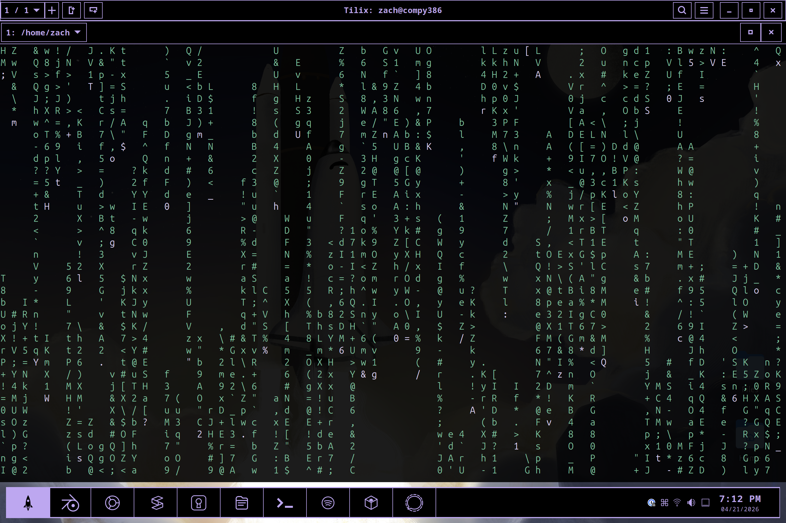
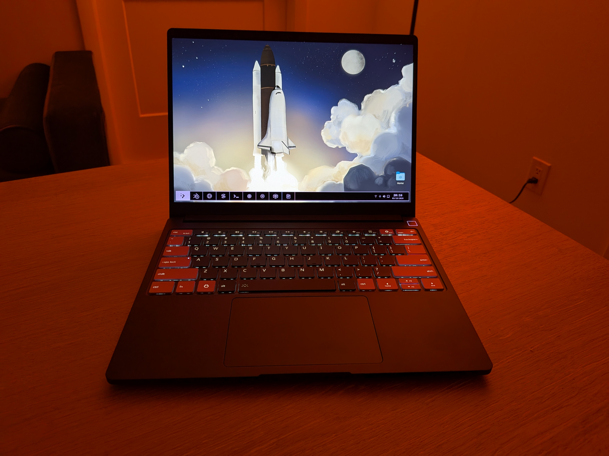
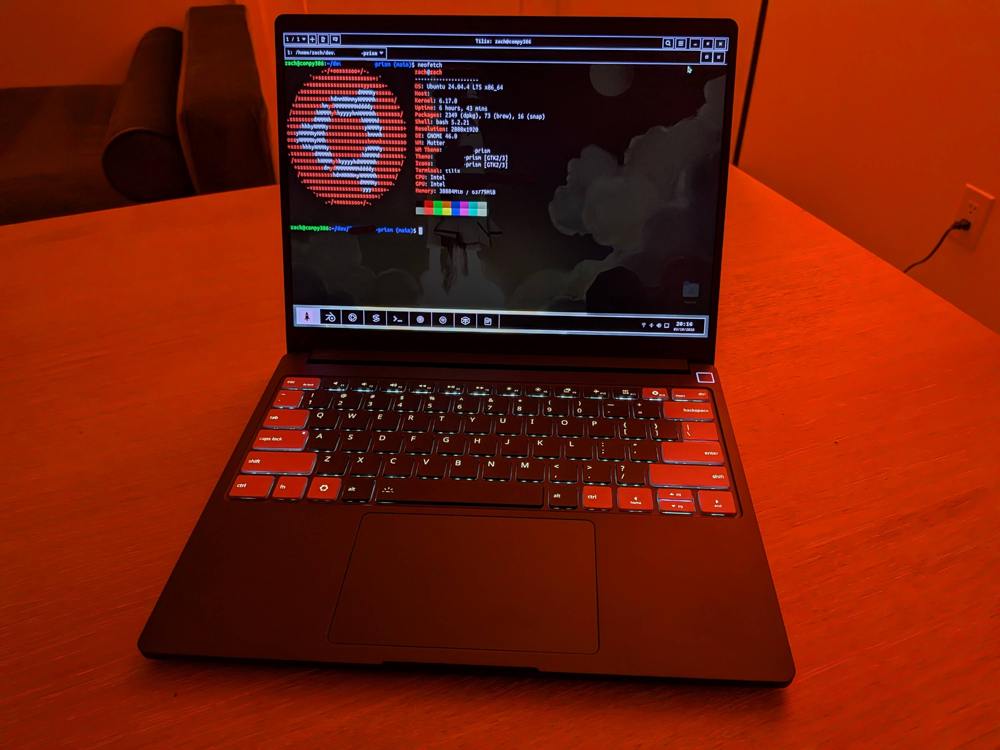
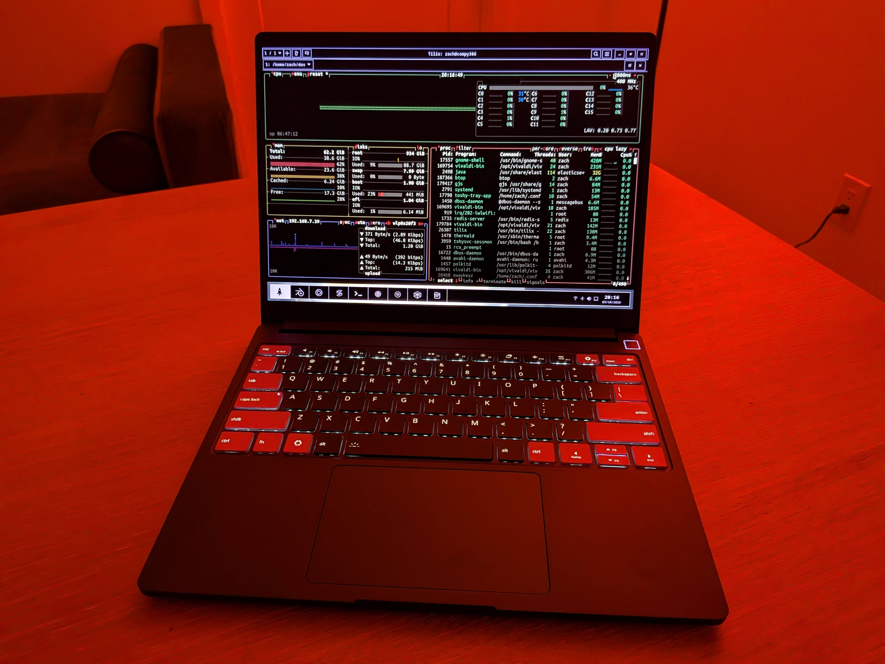

# gnome-prism

<p align="center">
  
</p>
<p align="center">
  
  
  
</p>

A desktop theme for Ubuntu/GNOME with a dark, high-contrast aesthetic.

**Design tokens:**
- Background: `#000000`
- Accent/stroke: `#BDA7F0` (lavender)
- Highlight: `#FF7447` (orange)
- Surface: `#191919`

## Prerequisites

```bash
sudo apt update
sudo apt install -y gnome-tweaks gnome-shell-extensions
```

Then enable **User Themes** in the Extensions app (or at [extensions.gnome.org/extension/19/user-themes](https://extensions.gnome.org/extension/19/user-themes/)).

## Install

```bash
./scripts/install.sh
```

This installs the theme, icons, wallpaper, and fonts into user paths, applies all settings via `gsettings`, and configures Dash to Panel for a bottom taskbar layout automatically.

## Uninstall

```bash
./scripts/uninstall.sh
```

Removes all installed `gnome-prism` files from user paths.

## Re-applying Theme Settings

If a GNOME update resets your settings, re-run the install script. To re-apply manually:

```bash
gsettings set org.gnome.desktop.interface gtk-theme 'gnome-prism'
gsettings set org.gnome.shell.extensions.user-theme name 'gnome-prism'
gsettings set org.gnome.desktop.interface icon-theme 'gnome-prism'
```

## App-Specific Setup

### Firefox

Two levels of Firefox theming are available:

1. **Theme add-on** (`apps/firefox/gnome-prism-theme/`) — install as a temporary extension in Firefox for toolbar/tab colors
2. **userChrome.css** — deeper UI customization:

```bash
./scripts/apply_firefox_userchrome.sh
```

### Vivaldi

```bash
./scripts/apply_vivaldi_theme.sh
```

Installs a CSS mod to `~/.local/share/gnome-prism/vivaldi/` and opens Vivaldi's mod path settings.

### Cursor / VS Code

The install script automatically applies `apps/cursor/gnome-prism-settings.json` to `~/.config/Cursor/User/settings.json`, merging color theme, font, and color customizations while preserving existing settings. The same settings work for VS Code (`~/.config/Code/User/settings.json`).

## Icon Theme

The icon theme ships overrides for 100+ applications as SVG (scalable) and PNG (256×256), including:

- GNOME core apps (Files, Settings, Terminal, Calculator, Calendar, Text Editor, etc.)
- Browsers: Firefox, Chrome, Chromium, Vivaldi
- Dev tools: Cursor, VS Code, Sublime Text, btop, htop
- Media: Spotify, VLC, Rhythmbox, Tenacity
- Productivity: LibreOffice (Writer, Calc, Impress, Draw), Evince, Shotwell
- Comms: Signal, Thunderbird
- Utilities: 1Password, Yubico Authenticator, Steam, Transmission, Remmina
- Framework-specific: Factory Reset Tools, Firmware Updater

Status/tray icon overrides: Wi-Fi, Bluetooth, audio volume, battery levels, brightness, night light, display.

## Troubleshooting

**Theme not showing in GNOME Tweaks:**
1. Confirm install ran without `sudo`
2. Check `~/.themes/gnome-prism` and `~/.local/share/themes/gnome-prism` exist
3. Fully quit and reopen Tweaks, or log out/in

**libadwaita apps (Files, Settings) not themed:**
GTK4 theming relies on `~/.config/gtk-4.0/gtk.css`. The install script writes this file. Re-run `./scripts/install.sh` if it was removed.

## Contributing

Contributions are welcome! If you have a bug report, feature request, or question, please [file a GitHub issue](https://github.com/FrameworkComputer/framework-prism/issues).

## Development Notes

- All public-facing names use `gnome-prism`
- libadwaita apps may ignore parts of custom GTK theming by design
- Best visual consistency comes from coordinating shell + GTK + icons + wallpaper

## Credits

- **Gaurav Singh** — theme design
- **Ross Jernigan** ([@bonkrat](https://github.com/bonkrat)) — design input and guidance
- **Zach Feldman** ([@zachfeldman](https://github.com/zachfeldman)) — implementation, vibe-coded this into a real Ubuntu theme
