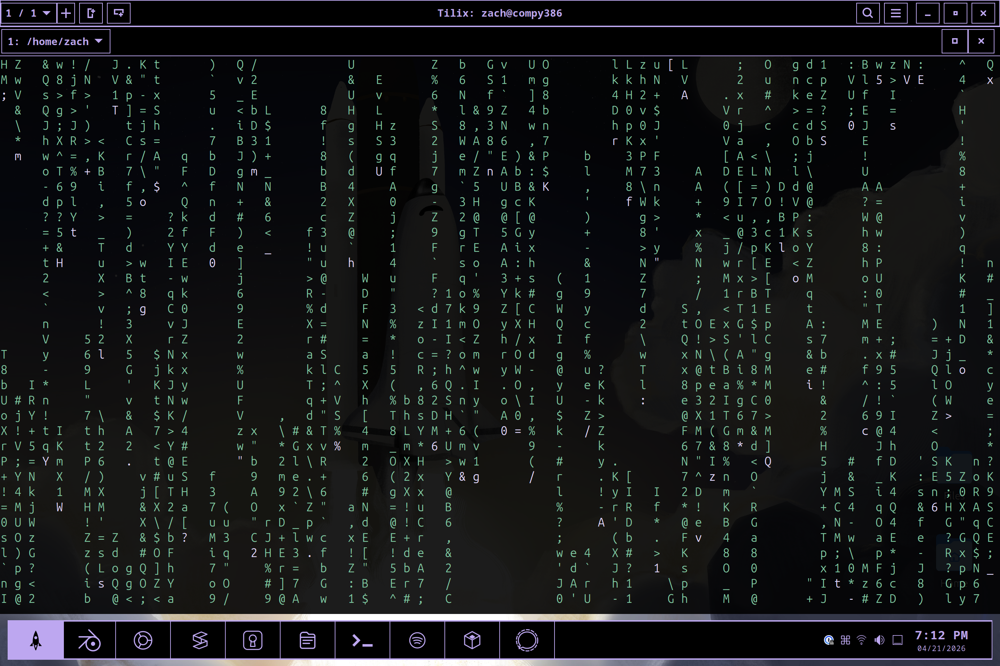
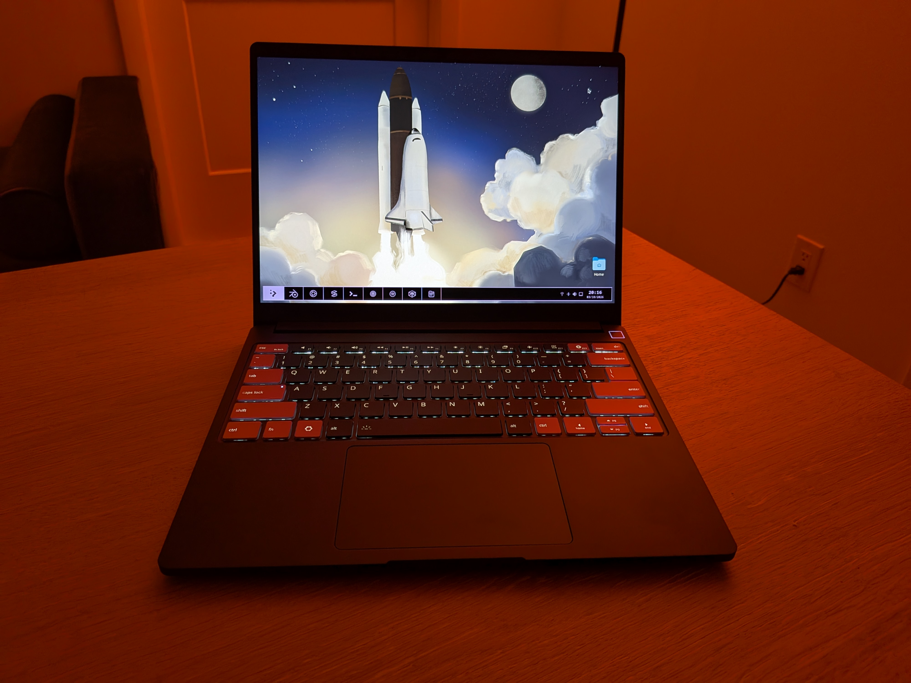
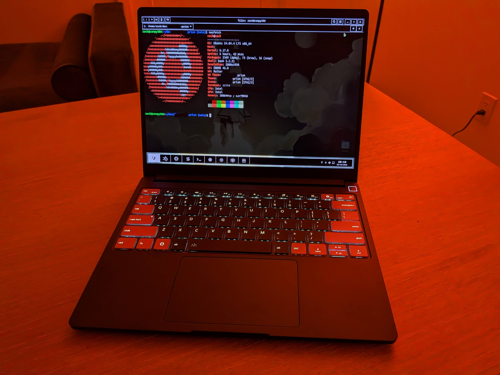
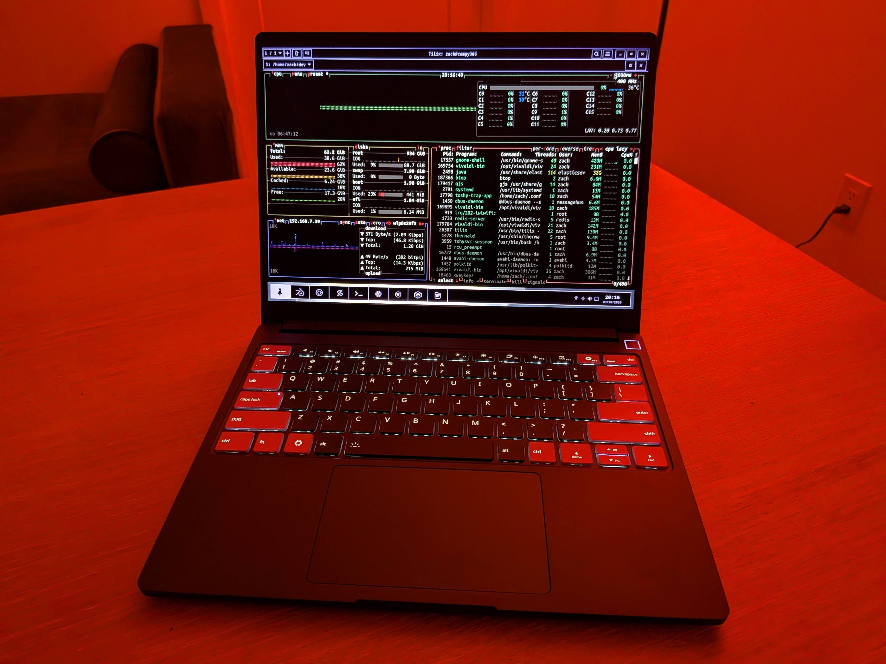

# gnome-prism

<p align="center">
  
</p>
<p align="center">
  
  
  
</p>

A desktop theme for GNOME with a dark, high-contrast aesthetic. Works on Ubuntu, Fedora, and other GNOME-based distributions.

**Design tokens:**
- Background: `#000000`
- Accent/stroke: `#BDA7F0` (lavender)
- Highlight: `#FF7447` (orange)
- Surface: `#191919`

## Quick Start

### 1. Install prerequisites

<details>
<summary><strong>Ubuntu / Debian</strong></summary>

```bash
sudo apt update
sudo apt install -y git gnome-tweaks gnome-shell-extensions
```
</details>

<details>
<summary><strong>Fedora</strong></summary>

```bash
sudo dnf install -y git gnome-tweaks gnome-extensions-app
```
</details>

### 2. Enable the User Themes extension

The **User Themes** extension allows GNOME Shell to use custom themes. You need to enable it before the shell theme will apply.

**Option A: Via Extensions app (recommended)**
1. Open the **Extensions** app (search for "Extensions" in your app launcher)
2. Find **User Themes** in the list and toggle it **ON**
3. If you don't see it, you may need to log out and back in first

**Option B: Via extensions.gnome.org**
1. Visit [extensions.gnome.org/extension/19/user-themes](https://extensions.gnome.org/extension/19/user-themes/)
2. Click the toggle to install/enable it
3. You may need to install the browser extension first if prompted

**Option C: Via command line**
```bash
gnome-extensions enable user-theme@gnome-shell-extensions.gcampax.github.com
```

> **Note:** The install script will attempt to enable User Themes automatically, but enabling it manually first ensures everything works smoothly.

### 3. Clone and install the theme

```bash
git clone https://github.com/zachfeldman/gnome-prism.git
cd gnome-prism
./scripts/install.sh
```

### 4. Log out and back in

This restarts GNOME Shell and applies all theme changes.

- **Wayland (Fedora and Ubuntu default):** You must log out and back in
- **X11 (fallback):** You can also press `Alt+F2`, type `r`, and press Enter

---

## What the install script does

The install script automatically:
- Installs the GTK theme, Shell theme, and icon theme
- Downloads and installs the DM Mono font
- Sets your wallpaper and lock screen background
- Configures Dash to Panel for a bottom taskbar layout
- Applies Firefox and Vivaldi browser theming
- Applies Cursor/VS Code editor settings

You don't need to run any manual `gsettings` commands — the script handles everything.

## Uninstall

```bash
./scripts/uninstall.sh
```

Removes all installed `gnome-prism` files from user paths.

## Re-applying Theme Settings

If a GNOME update resets your settings, re-run the install script. To re-apply manually:

```bash
gsettings set org.gnome.desktop.interface gtk-theme 'gnome-prism'
gsettings set org.gnome.shell.extensions.user-theme name 'gnome-prism'
gsettings set org.gnome.desktop.interface icon-theme 'gnome-prism'
```

## App-Specific Setup

### Firefox

Two levels of Firefox theming are available:

1. **Theme add-on** (`apps/firefox/gnome-prism-theme/`) — install as a temporary extension in Firefox for toolbar/tab colors
2. **userChrome.css** — deeper UI customization:

```bash
./scripts/apply_firefox_userchrome.sh
```

### Ghostty

The install script writes `apps/ghostty/gnome-prism` to
`~/.config/ghostty/themes/gnome-prism` and sets `theme = gnome-prism` in an
existing `~/.config/ghostty/config`. If you have no config yet, create one with:

```
theme = gnome-prism
```

Ghostty reads its config at startup; press `ctrl+shift+,` to reload it in place.
The colors are the same tokens as the Tilix scheme, so both terminals match.

### Vivaldi

```bash
./scripts/apply_vivaldi_theme.sh
```

Installs a CSS mod to `~/.local/share/gnome-prism/vivaldi/` and opens Vivaldi's mod path settings.

### Cursor / VS Code

The install script automatically applies `apps/cursor/gnome-prism-settings.json` to `~/.config/Cursor/User/settings.json`, merging color theme, font, and color customizations while preserving existing settings. The same settings work for VS Code (`~/.config/Code/User/settings.json`).

## Icon Theme

The icon theme ships overrides for 100+ applications as SVG (scalable) and PNG (256×256), including:

- GNOME core apps (Files, Settings, Terminal, Calculator, Calendar, Text Editor, etc.)
- Browsers: Firefox, Chrome, Chromium, Vivaldi
- Terminals: GNOME Terminal, Tilix, Ptyxis, Ghostty
- Dev tools: Cursor, VS Code, Sublime Text, btop, htop
- Media: Spotify, VLC, Rhythmbox, Tenacity
- Productivity: LibreOffice (Writer, Calc, Impress, Draw), Evince, Shotwell
- Comms: Signal, Thunderbird
- Utilities: 1Password, Yubico Authenticator, Steam, Transmission, Remmina
- Framework-specific: Factory Reset Tools, Firmware Updater

Status/tray icon overrides: Wi-Fi, Bluetooth, audio volume, battery levels, brightness, night light, display.

## Troubleshooting

**Shell theme not applying:**
1. Make sure the **User Themes** extension is enabled (see Step 2 above)
2. Log out and back in (required on Wayland)
3. Run `gnome-extensions list` and confirm `user-theme@gnome-shell-extensions.gcampax.github.com` is listed

**Theme not showing in GNOME Tweaks:**
1. Confirm install ran without `sudo`
2. Check `~/.themes/gnome-prism` and `~/.local/share/themes/gnome-prism` exist
3. Fully quit and reopen Tweaks, or log out/in

**libadwaita apps (Files, Settings) not themed:**
GTK4 theming relies on `~/.config/gtk-4.0/gtk.css`. The install script writes this file. Re-run `./scripts/install.sh` if it was removed.

**Icons not updating for some apps:**
Some apps (especially Snaps and Flatpaks) use hardcoded icon paths. The install script creates overrides for common apps, but you may need to log out/in or run `gtk-update-icon-cache ~/.local/share/icons/gnome-prism` to refresh.

**Taskbar icons look misaligned (Fedora):**
Re-run `./scripts/setup_bottom_panel.sh` after logging in. The Dash to Panel extension needs to be fully loaded before the script can apply all settings.

## Screensaver (optional)

GNOME Prism can optionally play a user-selected looping video on GNOME's
**real, secure lock screen** — a maintained fork of
[Live Lock Screen](https://github.com/nick-redwill/LiveLockScreen), developed
in its own repository,
[zachfeldman/LiveLockScreen](https://github.com/zachfeldman/LiveLockScreen)
(UUID `gnome-prism-screensaver@zachfeldman`, AGPL-3.0 licensed — separate
from this repository's MIT license; see that repo's `NOTICE.md`).

**This never replaces, weakens, or bypasses GNOME's authentication.** Locking
is always performed by GNOME itself (`Main.screenShield.lock()`); the
extension only changes what's visually shown before you unlock. Interacting
with the keyboard, mouse, touchpad, or touchscreen always reveals GNOME's
normal password prompt.

### What it does

- Plays your chosen video full-screen behind GNOME's lock dialog.
- Optionally rotate between videos in a folder instead of playing a single
  file — sequential (in order, resuming where it left off) or random,
  picking a new one each time the screensaver starts.
- Optional "clean" mode hides the clock, date, and notifications until you
  interact, so only the video shows initially.
- Start it immediately from Quick Settings ("Screensaver") or a configurable
  keyboard shortcut (default `Super+Shift+L`) — both just trigger a normal
  GNOME lock.
- Everything else (loop, scaling, blur/grayscale/pause on prompt,
  disable-on-battery, keep-awake) is configurable in the extension's
  preferences.

### Supported GNOME versions

Declared as GNOME Shell 46–50 in `metadata.json`, inherited from the upstream
Live Lock Screen project's own tested range. GNOME Prism has not
independently re-verified every one of those versions; if something breaks
on your version, clean mode and other GNOME-Shell-private-API-dependent
behavior are designed to fail safe back to normal locking (see Known
limitations below) rather than leaving you unable to unlock.

### Dependencies

Requires GStreamer's good/bad/ugly plugins for broad video codec support.
The core elements the extension itself needs (`playbin`, `appsink`,
`videoconvert`, `videoscale`) are part of `gstreamer-plugins-base`, which is
essentially always already installed:

```bash
# Fedora
sudo dnf install gstreamer1-plugins-good gstreamer1-plugins-bad-free \
  gstreamer1-plugins-ugly gstreamer1-plugins-bad-free-extras

# Ubuntu/Debian
sudo apt install gstreamer1.0-plugins-good gstreamer1.0-plugins-bad gstreamer1.0-plugins-ugly
```

`scripts/install_screensaver.sh` detects your distro and installs these
automatically, warning (never silently failing the whole install) if a
package isn't available for your release.

### Installation

```bash
./scripts/install.sh --with-screensaver
# or, standalone:
./scripts/install_screensaver.sh
```

This is opt-in only — it's never installed as part of a plain
`./scripts/install.sh` run, since it needs a user-selected video and extra
packages.

**Log out and back in afterwards** (required on Wayland — and after every
update to the extension — for GNOME Shell to load it).

### Selecting a video

```bash
gnome-extensions prefs gnome-prism-screensaver@zachfeldman
```

Pick a video file on the General page. GNOME Prism never copies this file
anywhere; it stays exactly where you put it, and uninstalling never touches
it.

### Starting it manually

- Quick Settings → "Screensaver" (toggle this off in preferences if you don't
  want it shown).
- Keyboard shortcut, default `Super+Shift+L` (configurable, and can be
  disabled entirely in preferences).
- Or just lock normally (`Super+L` / `loginctl lock-session`) — the
  screensaver activates on any lock, not only via the actions above.

### Configuring the shortcut

Open preferences (`gnome-extensions prefs gnome-prism-screensaver@zachfeldman`)
→ Screensaver page → set or clear the shortcut field, and toggle it on/off.

### Disabling or uninstalling

```bash
# Disable without removing:
gnome-extensions disable gnome-prism-screensaver@zachfeldman

# Fully remove (part of the normal uninstall; only removes this extension's
# own files, never touches other extensions or your video file):
./scripts/uninstall.sh
```

### Known limitations

- "Clean" mode (hiding the clock/date/notifications) and suppression of
  GNOME's own lock-transition "curtain" (so the video doesn't briefly go
  black right after locking) both rely on private GNOME Shell internals
  that can change between versions. If they're not found, both are silently
  skipped and the screensaver falls back to normal GNOME behavior — locking
  itself is never affected.
- Inherited from upstream: possible audio/video desync after suspend/wake,
  and possible clicking/crackling audio on pause/play.
- Video is decoded and rendered directly inside GNOME Shell's own process
  (see the screensaver repo's `NOTICE.md` for why); this avoids
  the cross-process/cross-GPU rendering issues the original window-based
  approach could hit, at the cost of a small extra CPU copy per frame to
  upload decoded frames into the Shell's compositor.

### Troubleshooting

```bash
# Confirm the extension is installed and its state:
gnome-extensions info gnome-prism-screensaver@zachfeldman

# Check logs for extension/lock-related messages:
journalctl --user -b | grep -iE 'gnome-prism|screensaver|lock'

# Confirm the required GStreamer element is available:
gst-inspect-1.0 appsink
```

If nothing plays, first confirm `gst-inspect-1.0 appsink` succeeds, then
confirm a video is selected in preferences, then check the journal for
`gnome-prism-screensaver:` log lines and any `In-process pipeline error`
messages.

### Manual test checklist

This feature touches your real lock screen, so verify it end-to-end on a
real GNOME session before relying on it:

1. Install GNOME Prism with screensaver support.
2. Log out and back in.
3. Confirm GNOME Prism and Dash to Panel still work.
4. Confirm ordinary `Super+L` locking works.
5. Confirm `loginctl lock-session` works.
6. Start the screensaver from Quick Settings.
7. Confirm the video is visible immediately, with no black gap (and, if
   clean mode is enabled, without the clock/date/notifications overlaid).
8. Interact with the keyboard or mouse.
9. Confirm GNOME's real password prompt appears.
10. Unlock successfully.
11. Confirm the extension does not immediately return from unlock-dialog to
    the normal session.
12. Test on AC and on battery.
13. Disable the screensaver extension and confirm normal locking still works.
14. Uninstall and confirm no lock-screen functionality is broken.

## Contributing

Contributions are welcome! If you have a bug report, feature request, or question, please [file a GitHub issue](https://github.com/zachfeldman/gnome-prism/issues).

## Development Notes

- All public-facing names use `gnome-prism`
- libadwaita apps may ignore parts of custom GTK theming by design
- Best visual consistency comes from coordinating shell + GTK + icons + wallpaper
- This repository is MIT licensed. The optional screensaver extension lives
  in its own AGPL-3.0 repository (a Live Lock Screen derivative — see
  [zachfeldman/LiveLockScreen](https://github.com/zachfeldman/LiveLockScreen)),
  kept separate specifically to avoid mixing licenses in one repo.

## Ports

- [prism-port](https://github.com/leverarchfile/prism-port): the prism palette and conventions for a tiling window manager environment (mango, foot, Neovim, fuzzel, mako, and others)

## Credits

- **Gaurav Singh** — theme design
- **Ross Jernigan** ([@bonkrat](https://github.com/bonkrat)) — design input and guidance
- **Zach Feldman** ([@zachfeldman](https://github.com/zachfeldman)) — implementation, vibe-coded this into a real Ubuntu theme
- **Sam Fleming** ([@SamPlaysKeys](https://github.com/SamPlaysKeys)) — added Fedora-specific features, as well as misc fixes
